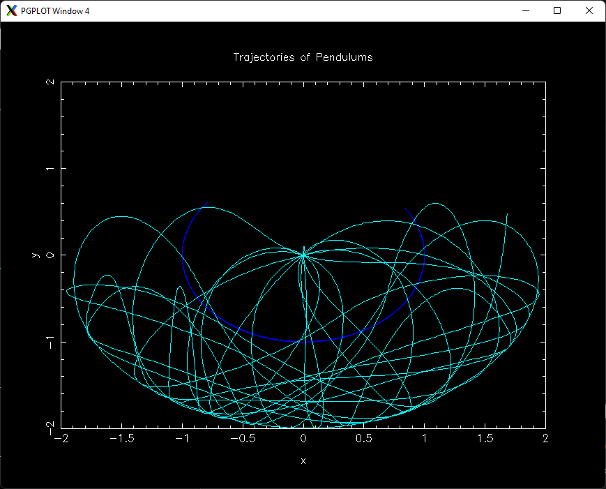
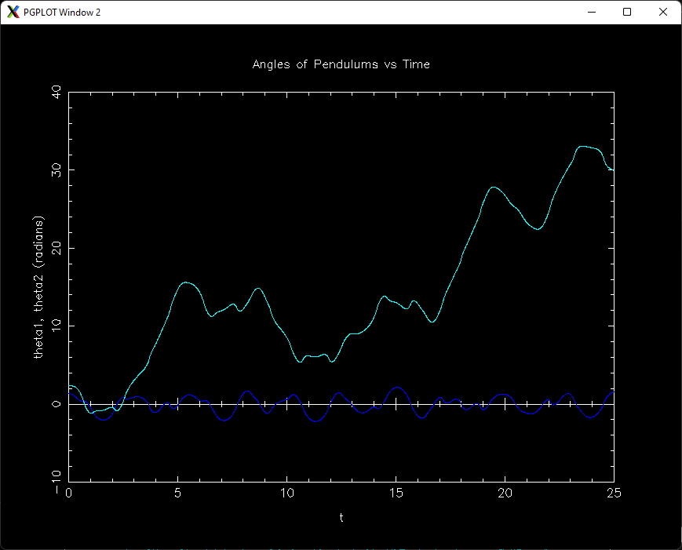
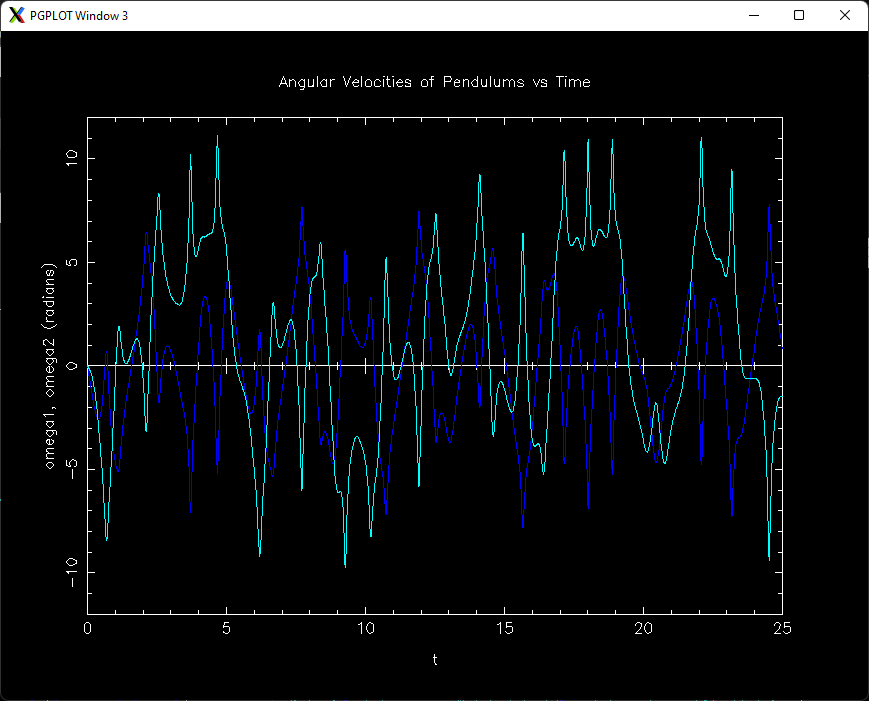

# double-pendulum

Double pendulum numerical solver that uses Runge-Kutta 4th Order methods for integration.

It plots the angles of the pendulums over time, the angular velocities 
of the pendulums over time, and the trajectories of the pendulums by 
plotting the x and y coordinates of the pendulums over time.

## Description

A double pendulum is a physical system that consists of two connected pendulums. Wherein, each pendulum
has rod of specific length and a bob of specific mass. The motion of a double pendulum is sensitive to the
initial conditions (angles and angular velocities) of each pendulum. A small change in the initial conditions
of the system can lead to a considerable change in the motion of the system. In this sense, the motion of a
double pendulum exhibits chaotic behaviour.

## Equations of Motion

The motion of a double pendulum is described by the following equations of motion:

$$\begin{aligned}
    \theta_1^{\prime} = \omega_1\end{aligned}$$

$$\begin{aligned}
    \theta_2^{\prime} = \omega_2\end{aligned}$$

$$\begin{aligned}
    \omega_1^{^{\prime}} = 
    \frac
    {m_2l_1\omega_1^2\sin{(\theta_2 - \theta_1)}\cos{(\theta_2 - \theta_1)} + m_2(g\sin{(\theta_2)}\cos{(\theta_2 - \theta_1)} + l_2\omega_2^2\sin{(\theta_2 - \theta_1)}) - (m_1 + m_2)g\sin{\theta_1}}
    {l_1(m_1 + m_2(1 - \cos^2{(\theta_2 - \theta_1)}))}\end{aligned}$$

$$\begin{aligned}
    \omega_2^{^{\prime}} = 
    \frac{-m_2l_2\omega_2^2\sin{(\theta_2 - \theta_1)}\cos{(\theta_2 - \theta_1)} + (m_1 + m_2)(g\sin{\theta_1}\cos{(\theta_2 - \theta_1)} - l_1\omega_1^2\sin{(\theta_2 - \theta_1)}) - (m_1 + m_2)g\sin{\theta_2}}
    {l_2(m_1 + m_2(1 - \cos^2{(\theta_2 - \theta_1)}))}\end{aligned}$$

## Sample Plots 

The following are plots generated by a double pendyulum with the following initial conditions:

Pendulum 1: 

$l_1 = 1.0$

$m_1 = 1.0$

$\theta_1 = \frac{77\pi}{180}$

$\omega_1 = 0.0$

Pendulum 2:

$l_2 = 1.0$

$m_2 = 1.0$

$\theta_2 = \frac{135\pi}{180}$

$\omega_2 = 0.0$

### Angles of Pendulums vs Time (blue: $\theta_1$, cyan: $\theta_2$)

### Angular Velocities of Pendulums vs Time (blue: $\omega_1$, cyan: $\omega_2$)

### Trajectories of Pendulums (blue: Pendulum 1, cyan: Pendulum 2)

